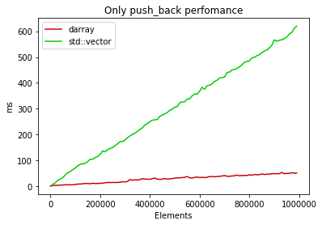
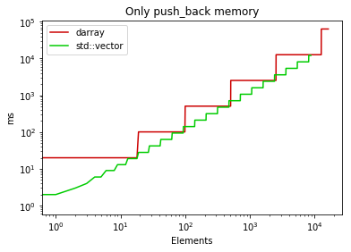
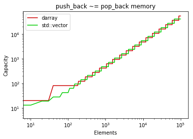

# dynarray
High-functional dynamic array implementation

<h1>Perfomance tests in comparison with std::vector</h1>

Time reqired to push_back <i>N</i> elements:

  

Memory reqired to only push_back <i>N</i> elements:

  

Memory reqired to push_back <i>N</i> elements while poping some of them:

  

